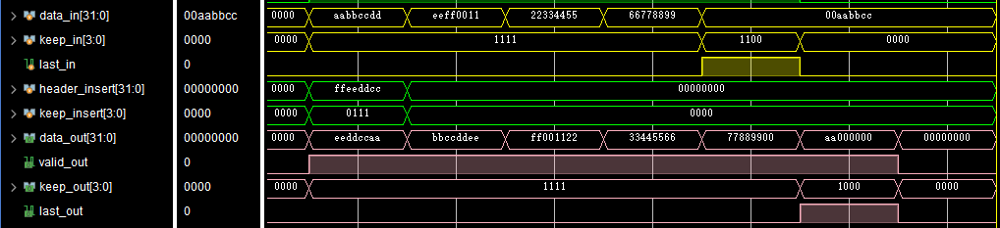

# 面试项目题

## 性能要求
1. 出于面积考虑，不能基于 FIFO 和状态机实现
2. 仿真要求验证 burst 传输无气泡、逐级反压、传输不丢数据、无重复数据等场景
3. 仿真验证全面，覆盖关键场景，并且采用随机方式生成验证激励

面试项目限时两天时间内完成，完成后把代码和仿真结果的截图上传到 GitHub 上，然后回复 GitHub 仓库链接地址即可

## 文件说明
    ---
     |--- code                                   #设计文件以及仿真文件
           |- data_master.sv
           |- header_master.sv
           |- tb.sv
           |_ axi_stream_insert_header.v
     |--- fig                                    #仿真波形图
     |--- xpr                                    #仿真所用 Vivado 工程
     |--- intern_test.pdf                        #面试项目题
     |_ _ README.md                              #本文件 

## 设计说明
本项目实现了将 **AXI Stream** 格式的 `header` 数据插入到同为 **AXI Stream** 格式的 `data` 数据流中，将 `data` 数据分为首拍、中间拍、末尾拍三种情况进行处理，每个时钟周期都会保存上个时钟周期的 `data` ，使用 `keep_insert` 信号生成的控制信号控制 MUX 的输出得到数据拼接后的结果，在末尾拍根据 `keep_insert` 有效的字节数和最后一拍的 `keep_in` 信号有效的字节数之和是否大于 4 决定 `data_out` 是否比 `data_in` 多一拍

## 仿真说明
在设计 testbench 时，没有用 ``AXI VIP`` 产生 **AXI Stream** 格式的数据输入，而是用 sv 实现了两个上游的 Master 端，分别为 `data_master` 和 `header_master` ， `axi_stream_insert_header` 作为从机，会响应两个主机的握手信号并将两个数据流按规定拼接后输出

在仿真模型中用**计数器**产生随机延迟，并且作为**随机数种子**产生传输的数据，**突发长度**也是随机的，但由于没有实现主从机握手信号的交互（握手不成功保持数据），所以在随机测试中有时 `header` 的握手信号并不在 `data_in` 的有效时期内，但模块设计是按照每次 `insert` 握手成功后刷新部分寄存器，所以在仿真中会看到没有 `insert` 握手成功也能传输的情况，这时是按照上一次成功的 `insert` 信号处理的，但并不意味模块功能错误

## 仿真结果

选取三种典型传输情形的仿真截图展示

### 情况一： data 的首拍数据跟 header 的单拍数据同步
仿真结果如下图所示：

### 情况二： data 的首拍数据快于 header 的单拍数据
仿真结果如下图所示：

### 情况三： data 的首拍数据慢于 header 的单拍数据
仿真结果如下图所示：

